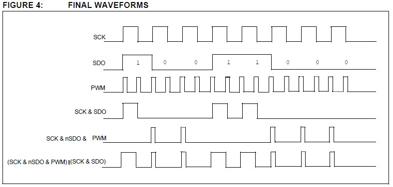
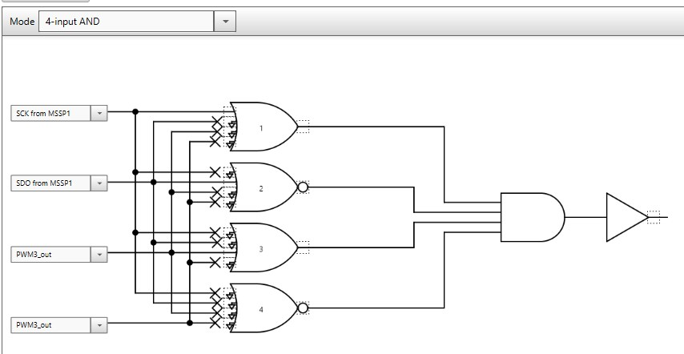
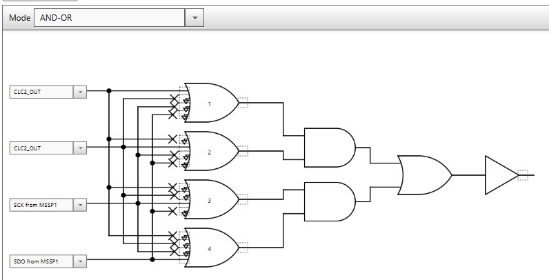
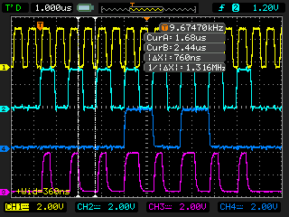
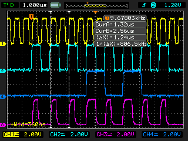
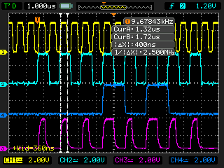
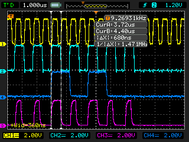

## Harware controll of WS2812b using CLC CONFIGURABLE LOGIC CELL
### Based on Microchip AN1606. The aplication note has couple mistakes.
* AN1890 can be used to use only one CLC and SPI SRAM as a buffer.
#### In my case PIC16F15376 is used.

Code generated with MCC

WS2812b Protocol 

       |'|    |    logic 0 400ns/850ns -> 1,25us
    ___| |____|    
        
       |'''|  |    logic 1 800ns/450ns -> 1,25us
    ___|   |__|

24bits per diode. GRB.
50us reset time between data packets.

To make hardware WS2812b driver we need to use Timer2/PWM, SPI, CLC

Final waveform is (SCK & nSDO & PWM)||(SCK & SDO)

* Timer2 is the source for PWM3. Timer3 is set to generate PWM.
* PWM Period need to be set to half the WS2812b period -> 0,5 * 1,25us = 625ns
* PWM +pulse width need to be equal logic 0 + width -> ~400ns
* SPI SCK +Pulse will be WS2812b logic 1 pulse, so width need to be ~800ns(+-150ns).
* SPI clock source is also TMR2 but final SPI SCK period will be TMR2 period*2.
* SCK + pulse fill be 0,5* SCK period = ~650ns

To combine all those signal need to use two CLCs:

* CLC2: (SCK & nSDO & PWM) -> CLC2out
* CLC4: CLC2_out ||(SCK & SDO) -> CLC4out
* CLC4out -> RB3 (WS2812b)

---------------
Programowanie XpressBoards z MPLABx:
we właściwościach projektu -> Building -> zanacz [Exclude this Line after build]
wpisac 
cp ${ImagePath} e:/       <- ukośnik jest w przeciwnym kierunku niż normalnie w windowsie!!!
Typ programatora -> symulator